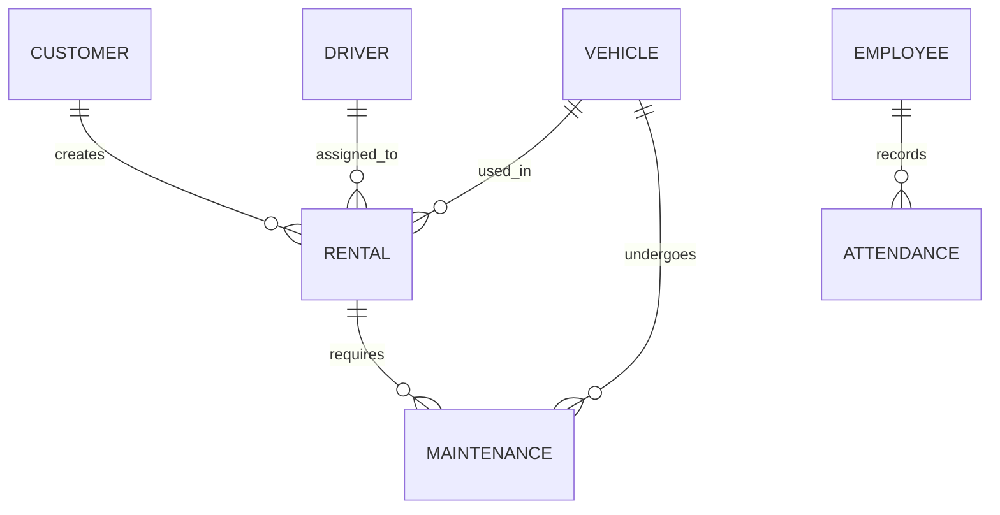

# 🚗 Royal Car Rent - Car Rental Management System

[](LICENSE)
[](https://www.oracle.com/java/)
[](https://www.mysql.com/)
[](https://netbeans.apache.org/)

A comprehensive car rental management system built with Java Swing and MySQL, designed to streamline vehicle rental operations for car rental businesses.

## 📋 Table of Contents

- [Overview](#overview)
- [Features](#-features)
- [System Architecture](#-system-architecture)
- [Prerequisites](#-prerequisites)
- [Installation](#-installation)
- [Configuration](#-configuration)
- [Usage](#-usage)
- [Database Schema](#-database-schema)
- [Project Structure](#-project-structure)
- [API Documentation](#-api-documentation)
- [Screenshots](#-screenshots)
- [Contributing](#-contributing)
- [Troubleshooting](#-troubleshooting)
- [License](#-license)
- [Contact](#-contact)

## Overview

Royal Car Rent is a desktop-based car rental management system that provides a complete solution for managing vehicle rentals, customer data, driver information, maintenance records, and financial transactions. The application is built using Java Swing for the GUI and MySQL for data persistence.

### 🎯 Key Objectives

- **Efficient Rental Management**: Streamline the car rental process from booking to return
- **Comprehensive Tracking**: Monitor vehicles, customers, drivers, and maintenance schedules
- **Financial Management**: Track income, expenses, and generate financial reports
- **User-Friendly Interface**: Intuitive desktop application with modern GUI components
- **Data Integrity**: Robust database design with proper relationships and constraints

## ✨ Features

### 🔐 Authentication & Security
- Secure user login system
- Role-based access control
- Password encryption
- Session management

### 🚙 Vehicle Management
- Vehicle registration and inventory tracking
- Vehicle status monitoring (available, rented, maintenance)
- Vehicle category management
- Maintenance history tracking
- Vehicle performance analytics

### 👥 Customer Management
- Customer registration and profile management
- Customer rental history
- Customer communication tracking
- Customer reports and analytics

### 🚗 Driver Management
- Driver registration and profile management
- Driver availability tracking
- Salary management
- Attendance tracking
- Performance monitoring

### 📅 Rental Management
- Rental booking and reservation system
- Rental agreement generation
- Rental status tracking
- Return processing
- Late fee calculation
- Rental history management

### 👨‍💼 Employee Management
- Employee registration and management
- Attendance tracking
- Salary management
- Role assignment
- Performance tracking

### 🔧 Maintenance Management
- Scheduled maintenance tracking
- Maintenance history records
- Maintenance cost tracking
- Vehicle downtime management
- Maintenance alerts and notifications

### 💰 Financial Management
- Income tracking and reporting
- Expense management
- Profit/loss calculations
- Financial dashboard
- Tax calculations
- Invoice generation

### 📊 Reporting System
- Comprehensive report generation
- Customer reports
- Driver reports
- Vehicle utilization reports
- Financial reports
- Maintenance reports
- Custom date range filtering

### 📈 Dashboard & Analytics
- Real-time dashboard with key metrics
- Chart visualizations
- Performance indicators
- Trend analysis
- Business intelligence insights

## 🏗️ System Architecture

```
┌─────────────────────────────────────────────────────────────┐
│                    Presentation Layer                       │
│  ┌─────────────┐ ┌─────────────┐ ┌─────────────┐           │
│  │   Swing GUI │ │   Forms     │ │   Reports   │           │
│  │   Components│ │   Management│ │   Generator │           │
│  └─────────────┘ └─────────────┘ └─────────────┘           │
├─────────────────────────────────────────────────────────────┤
│                    Business Logic Layer                     │
│  ┌─────────────┐ ┌─────────────┐ ┌─────────────┐           │
│  │   Model     │ │   Service   │ │   Validation│           │
│  │   Classes   │ │   Layer     │ │   Logic     │           │
│  └─────────────┘ └─────────────┘ └─────────────┘           │
├─────────────────────────────────────────────────────────────┤
│                    Data Access Layer                        │
│  ┌─────────────┐ ┌─────────────┐ ┌─────────────┐           │
│  │   MySQL2    │ │   Connection│ │   Query     │           │
│  │   Connector │ │   Pool      │ │   Builder   │           │
│  └─────────────┘ └─────────────┘ └─────────────┘           │
├─────────────────────────────────────────────────────────────┤
│                    Database Layer                           │
│  ┌─────────────┐ ┌─────────────┐ ┌─────────────┐           │
│  │   MySQL     │ │   Tables    │ │   Stored    │           │
│  │   Database  │ │   & Views   │ │   Procedures│           │
│  └─────────────┘ └─────────────┘ └─────────────┘           │
└─────────────────────────────────────────────────────────────┘
```

## 🛠️ Prerequisites

Before installing Royal Car Rent, ensure you have the following software installed:

### System Requirements
- **Operating System**: Windows 10/11, macOS 10.15+, or Linux (Ubuntu 18.04+)
- **RAM**: Minimum 4GB (8GB recommended)
- **Storage**: At least 2GB free space
- **Java Runtime**: JRE 8 or higher

### Required Software

#### Java Development Kit (JDK)
```bash
# Check if Java is installed
java -version

# If not installed, download from:
# https://www.oracle.com/java/technologies/javase-downloads.html
```

#### MySQL Database Server
```bash
# MySQL 8.0 or higher
# Download from: https://dev.mysql.com/downloads/mysql/
```

#### NetBeans IDE (for development)
```bash
# NetBeans 12.0 or higher
# Download from: https://netbeans.apache.org/download/
```

### Required Libraries
The following libraries are included in the `lib` directory:
- MySQL Connector/J
- JFreeChart (for charts and graphs)
- JasperReports (for report generation)
- AbsoluteLayout
- Toast notifications library

## 🚀 Installation

### 1. Clone the Repository
```bash
git clone https://github.com/himeshhansana/RoyalCarRent.git
cd RoyalCarRent
```

### 2. Database Setup

#### Create MySQL Database
```sql
-- Start MySQL server and login
mysql -u root -p

-- Create database
CREATE DATABASE royalcarrent;
USE royalcarrent;

-- Import the database schema
SOURCE gfvdbgn.sql;
```

#### Configure Database Connection
Edit the database connection in `src/model/MySQL2.java`:
```java
// Update these values according to your MySQL configuration
connection = DriverManager.getConnection(
    "jdbc:mysql://localhost:3306/royalcarrent", 
    "your_username", 
    "your_password"
);
```

### 3. Build and Run

#### Using NetBeans IDE
1. Open NetBeans IDE
2. Click **File → Open Project**
3. Navigate to the RoyalCarRent folder and select it
4. Right-click on the project and select **Build**
5. Right-click on the project and select **Run**

#### Using Command Line
```bash
# Build the project
ant clean compile

# Run the application
ant run
```

#### Using JAR File
```bash
# Build JAR file
ant jar

# Run the JAR
java -jar dist/RoyalCarRent.jar
```

## ⚙️ Configuration

### Database Configuration

#### Connection Settings
Update the `MySQL2.java` file with your database credentials:

```java
public class MySQL2 {
    private static final String DB_URL = "jdbc:mysql://localhost:3306/royalcarrent";
    private static final String DB_USER = "your_username";
    private static final String DB_PASSWORD = "your_password";
    
    // Connection configuration
    public static void createConnection() throws Exception {
        if (connection == null) {
            Class.forName("com.mysql.cj.jdbc.Driver");
            connection = DriverManager.getConnection(DB_URL, DB_USER, DB_PASSWORD);
        }
    }
}
```

#### Connection Pool Settings
For production environments, consider implementing connection pooling:

```java
// Example configuration for HikariCP
HikariConfig config = new HikariConfig();
config.setJdbcUrl("jdbc:mysql://localhost:3306/royalcarrent");
config.setUsername("your_username");
config.setPassword("your_password");
config.setMaximumPoolSize(20);
config.setMinimumIdle(5);
config.setConnectionTimeout(30000);
```

### Application Configuration

#### Logging Configuration
The application uses Java Logging API. Configure logging in your main class:

```java
Logger logger = Logger.getLogger("RoyalCarRent");
FileHandler fileHandler = new FileHandler("logs/application.log");
logger.addHandler(fileHandler);
logger.setLevel(Level.INFO);
```

#### UI Configuration
Customize the look and feel in the main application startup:

```java
// Set system look and feel
UIManager.setLookAndFeel(UIManager.getSystemLookAndFeel());

// Or use a custom theme
UIManager.setLookAndFeel("com.formdev.flatlaf.FlatLightLaf");
```

## 📖 Usage

### Initial Setup

#### 1. Administrator Login
When you first run the application:
- **Email**: `hasiya@gmail.com` (default admin)
- **Password**: `ncbes7154` (change this immediately)

#### 2. Change Default Credentials
1. Login with default credentials
2. Navigate to **Admin → User Management**
3. Change the default password
4. Create additional user accounts as needed

### Core Workflows

#### Vehicle Registration
1. **Navigate to Vehicle Management**
   - Click **Vehicles** from the main menu
   - Click **Add New Vehicle**

2. **Enter Vehicle Details**
   ```
   - Vehicle Number: ABC-1234
   - Make/Model: Toyota Corolla
   - Year: 2023
   - Category: Sedan
   - Daily Rate: $50.00
   - Status: Available
   ```

3. **Upload Vehicle Images**
   - Click **Browse** to select vehicle photos
   - Add multiple images for better presentation

#### Customer Registration
1. **Access Customer Management**
   - Click **Customers** from the main menu
   - Select **Add New Customer**

2. **Customer Information**
   ```
   - Full Name: John Doe
   - Email: john.doe@email.com
   - Phone: +1-555-0123
   - Address: 123 Main St, City, State
   - License Number: DL123456789
   - License Expiry: 2025-12-31
   ```

#### Creating a Rental
1. **Start New Rental**
   - Click **Rentals** → **New Rental**
   - Select customer from database or create new

2. **Vehicle Selection**
   - Choose available vehicle
   - Set rental period
   - Confirm daily/weekly rates

3. **Driver Assignment** (if required)
   - Select available driver
   - Set driver compensation
   - Confirm driver availability

4. **Final Agreement**
   - Review rental terms
   - Calculate total cost
   - Generate rental agreement
   - Process payment

### Administrative Functions

#### User Management
- Create new user accounts
- Assign roles and permissions
- Monitor user activity
- Reset passwords

#### Financial Reporting
- Generate income reports
- Track expenses
- Calculate profit/loss
- Export financial data

#### System Maintenance
- Database backups
- System logs review
- Performance monitoring
- Update configurations

## 🗄️ Database Schema

### Core Tables

#### Users Table
```sql
CREATE TABLE users (
    id INT PRIMARY KEY AUTO_INCREMENT,
    email VARCHAR(100) UNIQUE NOT NULL,
    password VARCHAR(255) NOT NULL,
    first_name VARCHAR(50) NOT NULL,
    last_name VARCHAR(50) NOT NULL,
    role ENUM('admin', 'manager', 'employee') DEFAULT 'employee',
    status ENUM('active', 'inactive') DEFAULT 'active',
    created_at TIMESTAMP DEFAULT CURRENT_TIMESTAMP,
    updated_at TIMESTAMP DEFAULT CURRENT_TIMESTAMP ON UPDATE CURRENT_TIMESTAMP
);
```

#### Vehicle Table
```sql
CREATE TABLE vehicle (
    id INT PRIMARY KEY AUTO_INCREMENT,
    vehicle_number VARCHAR(20) UNIQUE NOT NULL,
    make VARCHAR(50) NOT NULL,
    model VARCHAR(50) NOT NULL,
    year INT NOT NULL,
    category_id INT,
    daily_rate DECIMAL(10,2) NOT NULL,
    status ENUM('available', 'rented', 'maintenance') DEFAULT 'available',
    created_at TIMESTAMP DEFAULT CURRENT_TIMESTAMP,
    FOREIGN KEY (category_id) REFERENCES category(id)
);
```

#### Customer Table
```sql
CREATE TABLE customer (
    id INT PRIMARY KEY AUTO_INCREMENT,
    first_name VARCHAR(50) NOT NULL,
    last_name VARCHAR(50) NOT NULL,
    email VARCHAR(100) UNIQUE,
    phone VARCHAR(20),
    address TEXT,
    license_number VARCHAR(50),
    license_expiry DATE,
    created_at TIMESTAMP DEFAULT CURRENT_TIMESTAMP
);
```

#### Rental Table
```sql
CREATE TABLE rental (
    id INT PRIMARY KEY AUTO_INCREMENT,
    customer_id INT NOT NULL,
    vehicle_id INT NOT NULL,
    driver_id INT,
    start_date DATE NOT NULL,
    end_date DATE NOT NULL,
    daily_rate DECIMAL(10,2) NOT NULL,
    total_amount DECIMAL(10,2),
    status ENUM('active', 'completed', 'cancelled') DEFAULT 'active',
    created_at TIMESTAMP DEFAULT CURRENT_TIMESTAMP,
    FOREIGN KEY (customer_id) REFERENCES customer(id),
    FOREIGN KEY (vehicle_id) REFERENCES vehicle(id),
    FOREIGN KEY (driver_id) REFERENCES driver(nic)
);
```

### Relationships



## 📁 Project Structure

```
RoyalCarRent/
├── 📁 src/
│   ├── 📁 gui/                     # GUI Components
│   │   ├── 📄 SignIn.java          # Login form
│   │   ├── 📄 Home.java            # Dashboard
│   │   ├── 📄 Customer.java        # Customer management
│   │   ├── 📄 Vehicle.java         # Vehicle management
│   │   ├── 📄 Rental.java          # Rental management
│   │   ├── 📄 Driver.java          # Driver management
│   │   ├── 📄 Employee.java        # Employee management
│   │   ├── 📄 Admin.java           # Admin panel
│   │   ├── 📄 Maintenance.java     # Maintenance tracking
│   │   └── 📄 FinancialManagement.java # Finance module
│   ├── 📁 model/
│   │   └── 📄 MySQL2.java          # Database connectivity
│   ├── 📁 images/                  # Application images
│   │   └── 📁 icon/                # Icon resources
│   └── 📁 reports/                 # JasperReports templates
│       ├── 📄 CustomerReports.jasper
│       ├── 📄 VehicleDetailsReport.jasper
│       ├── 📄 RentalHistory.jasper
│       └── 📄 IncomeDetailsReport.jasper
├── 📁 lib/                         # External libraries
│   ├── 📄 mysql-connector-java.jar
│   ├── 📄 jfreechart.jar
│   └── 📄 jasperreports.jar
├── 📁 nbproject/                   # NetBeans project files
│   ├── 📄 project.properties
│   ├── 📄 project.xml
│   └── 📁 private/
├── 📄 build.xml                    # Ant build script
├── 📄 gfvdbgn.sql                 # Database schema
├── 📄 manifest.mf                  # JAR manifest
└── 📄 README.md                    # This file
```

### Key Components

#### GUI Package (`src/gui/`)
- **Forms**: All Swing-based user interface forms
- **Event Handlers**: User interaction logic
- **Data Binding**: Form-to-database connectivity
- **Validation**: Input validation and error handling

#### Model Package (`src/model/`)
- **MySQL2.java**: Central database connection manager
- **Data Access Objects**: Database query execution
- **Connection Pooling**: Efficient database connections

#### Reports Package (`src/reports/`)
- **JasperReports Templates**: Pre-designed report layouts
- **PDF Generation**: Automated report creation
- **Data Visualization**: Charts and graphs

## 📊 API Documentation

### Database Connection API

#### MySQL2 Class Methods

```java
public class MySQL2 {
    
    /**
     * Creates a database connection
     * @throws Exception if connection fails
     */
    public static void createConnection() throws Exception
    
    /**
     * Executes SELECT queries
     * @param query SQL SELECT statement
     * @return ResultSet containing query results
     * @throws Exception if query execution fails
     */
    public static ResultSet executeSearch(String query) throws Exception
    
    /**
     * Executes INSERT, UPDATE, DELETE queries
     * @param query SQL IUD statement
     * @return Number of affected rows
     * @throws Exception if query execution fails
     */
    public static Integer executeIUD(String query) throws Exception
}
```

#### Usage Examples

```java
// Search query example
try {
    ResultSet rs = MySQL2.executeSearch("SELECT * FROM customer WHERE id = 1");
    while(rs.next()) {
        System.out.println(rs.getString("first_name"));
    }
} catch(Exception e) {
    e.printStackTrace();
}

// Insert query example
try {
    String insertQuery = "INSERT INTO customer (first_name, last_name, email) VALUES ('John', 'Doe', 'john@email.com')";
    int rowsAffected = MySQL2.executeIUD(insertQuery);
    System.out.println("Rows inserted: " + rowsAffected);
} catch(Exception e) {
    e.printStackTrace();
}
```

### Common Query Patterns

#### Customer Management
```java
// Get all customers
"SELECT * FROM customer ORDER BY first_name"

// Search customer by name
"SELECT * FROM customer WHERE first_name LIKE '%" + searchTerm + "%'"

// Get customer rental history
"SELECT r.*, v.vehicle_number FROM rental r JOIN vehicle v ON r.vehicle_id = v.id WHERE r.customer_id = " + customerId
```

#### Vehicle Management
```java
// Get available vehicles
"SELECT * FROM vehicle WHERE status = 'available'"

// Update vehicle status
"UPDATE vehicle SET status = 'rented' WHERE id = " + vehicleId

// Get vehicle maintenance history
"SELECT * FROM maintenance WHERE vehicle_id = " + vehicleId + " ORDER BY maintenance_date DESC"
```

#### Rental Operations
```java
// Create new rental
"INSERT INTO rental (customer_id, vehicle_id, start_date, end_date, daily_rate, total_amount) VALUES (?, ?, ?, ?, ?, ?)"

// Get active rentals
"SELECT r.*, c.first_name, c.last_name, v.vehicle_number FROM rental r JOIN customer c ON r.customer_id = c.id JOIN vehicle v ON r.vehicle_id = v.id WHERE r.status = 'active'"

// Complete rental
"UPDATE rental SET status = 'completed', end_date = CURDATE() WHERE id = " + rentalId
```

## 🖼️ Screenshots

### Dashboard

*Main dashboard showing key metrics and system overview*

### Vehicle Management

*Vehicle inventory and management interface*

### Customer Management

*Customer registration and profile management*

### Rental Process

*Step-by-step rental creation workflow*

### Financial Reports

*Comprehensive financial reporting and analytics*

## 🤝 Contributing

We welcome contributions from the community! Here's how you can help improve Royal Car Rent:

### Getting Started
1. **Fork the Repository**
   ```bash
   git clone https://github.com/himeshhansana/RoyalCarRent.git
   cd RoyalCarRent
   ```

2. **Create a Feature Branch**
   ```bash
   git checkout -b feature/your-feature-name
   ```

3. **Make Your Changes**
   - Follow the existing code style
   - Add comments for complex logic
   - Update documentation as needed

4. **Test Your Changes**
   - Run the application thoroughly
   - Test all affected functionality
   - Verify database operations

5. **Submit a Pull Request**
   - Commit your changes with clear messages
   - Push to your fork
   - Create a pull request with detailed description

### Code Style Guidelines

#### Java Conventions
```java
// Use camelCase for variables and methods
private String customerName;
public void updateCustomerInfo() { }

// Use PascalCase for classes
public class CustomerManager { }

// Use UPPER_CASE for constants
private static final String DATABASE_URL = "jdbc:mysql://localhost:3306/royalcarrent";

// Add JavaDoc comments for public methods
/**
 * Updates customer information in the database
 * @param customerId The unique identifier for the customer
 * @param customerData Updated customer information
 * @return true if update was successful, false otherwise
 */
public boolean updateCustomer(int customerId, Customer customerData) { }
```

#### SQL Conventions
```sql
-- Use lowercase for SQL keywords
select customer_id, first_name, last_name from customer;

-- Use descriptive table and column names
CREATE TABLE vehicle_maintenance_record (
    id INT PRIMARY KEY AUTO_INCREMENT,
    vehicle_id INT NOT NULL,
    maintenance_date DATE NOT NULL,
    maintenance_type VARCHAR(100),
    cost DECIMAL(10,2)
);
```

### Areas for Contribution

#### 🐛 Bug Fixes
- Database connection issues
- UI/UX improvements
- Performance optimizations
- Error handling enhancements

#### ✨ New Features
- Mobile application integration
- Online booking system
- Payment gateway integration
- Advanced reporting features
- Multi-language support

#### 📚 Documentation
- API documentation
- User guides
- Installation tutorials
- Video demonstrations

#### 🧪 Testing
- Unit tests
- Integration tests
- Performance tests
- Security audits

### Reporting Issues

When reporting bugs or issues, please include:

1. **System Information**
   - Operating System
   - Java version
   - MySQL version
   - NetBeans IDE version

2. **Steps to Reproduce**
   - Detailed steps that led to the issue
   - Expected behavior
   - Actual behavior

3. **Error Messages**
   - Complete error logs
   - Stack traces
   - Screenshots if applicable

4. **Additional Context**
   - Any recent changes made
   - Related issues or discussions

## 🔧 Troubleshooting

### Common Issues and Solutions

#### Database Connection Problems

**Issue**: `SQLException: Access denied for user`
```
Solution:
1. Verify MySQL credentials in MySQL2.java
2. Check MySQL server is running
3. Ensure user has proper permissions
4. Test connection with MySQL client
```

**Issue**: `ClassNotFoundException: com.mysql.cj.jdbc.Driver`
```
Solution:
1. Ensure MySQL Connector/J is in lib folder
2. Check NetBeans project libraries
3. Verify JAR file is not corrupted
4. Rebuild the project
```

#### Application Startup Issues

**Issue**: `Exception in thread "main" java.awt.HeadlessException`
```
Solution:
1. Ensure GUI environment is available
2. For Linux: Install X11 forwarding
3. For servers: Use VNC or remote desktop
4. Check DISPLAY environment variable
```

**Issue**: Memory allocation errors
```
Solution:
1. Increase JVM heap size: -Xmx2g
2. Check available system memory
3. Close unnecessary applications
4. Monitor memory usage during runtime
```

#### GUI Related Problems

**Issue**: Forms not displaying correctly
```
Solution:
1. Check screen resolution and scaling
2. Update graphics drivers
3. Try different look and feel themes
4. Verify NetBeans form files (.form) are intact
```

**Issue**: Charts not rendering
```
Solution:
1. Ensure JFreeChart library is available
2. Check data source connectivity
3. Verify chart data is not empty
4. Update chart rendering components
```

#### Report Generation Issues

**Issue**: JasperReports not working
```
Solution:
1. Verify JasperReports JAR files
2. Check report template files (.jasper)
3. Ensure proper data source configuration
4. Test with sample data
```

### Performance Optimization

#### Database Performance
```sql
-- Add indexes for frequently queried columns
CREATE INDEX idx_customer_email ON customer(email);
CREATE INDEX idx_rental_dates ON rental(start_date, end_date);
CREATE INDEX idx_vehicle_status ON vehicle(status);

-- Optimize query performance
EXPLAIN SELECT * FROM rental 
WHERE customer_id = 1 
AND status = 'active';
```

#### Application Performance
```java
// Use connection pooling for better performance
HikariConfig config = new HikariConfig();
config.setMaximumPoolSize(20);
config.setMinimumIdle(5);

// Cache frequently accessed data
Map<Integer, Customer> customerCache = new HashMap<>();

// Use prepared statements for better performance
PreparedStatement stmt = connection.prepareStatement(
    "SELECT * FROM customer WHERE id = ?"
);
```

### Logging and Debugging

#### Enable Debug Logging
```java
// Add to main class
Logger.getLogger("RoyalCarRent").setLevel(Level.FINE);

// Add debug statements
logger.fine("Processing rental for customer: " + customerId);
logger.info("Rental created successfully with ID: " + rentalId);
```

#### Log File Locations
```
Windows: %APPDATA%/RoyalCarRent/logs/
macOS: ~/Library/Application Support/RoyalCarRent/logs/
Linux: ~/.local/share/RoyalCarRent/logs/
```

### Getting Help

#### Community Support
- **GitHub Issues**: [Report bugs and request features](https://github.com/himeshhansana/RoyalCarRent/issues)
- **Discussions**: [Ask questions and share ideas](https://github.com/himeshhansana/RoyalCarRent/discussions)
- **Wiki**: [Browse documentation and guides](https://github.com/himeshhansana/RoyalCarRent/wiki)

#### Professional Support
- Email: support@royalcarrent.com
- Documentation: [Official Documentation](https://docs.royalcarrent.com)
- Training: [Video Tutorials](https://tutorials.royalcarrent.com)

## 📄 License

This project is licensed under the MIT License - see the [LICENSE](LICENSE) file for details.

```
MIT License

Copyright (c) 2024 Royal Car Rent

Permission is hereby granted, free of charge, to any person obtaining a copy
of this software and associated documentation files (the "Software"), to deal
in the Software without restriction, including without limitation the rights
to use, copy, modify, merge, publish, distribute, sublicense, and/or sell
copies of the Software, and to permit persons to whom the Software is
furnished to do so, subject to the following conditions:

The above copyright notice and this permission notice shall be included in all
copies or substantial portions of the Software.

THE SOFTWARE IS PROVIDED "AS IS", WITHOUT WARRANTY OF ANY KIND, EXPRESS OR
IMPLIED, INCLUDING BUT NOT LIMITED TO THE WARRANTIES OF MERCHANTABILITY,
FITNESS FOR A PARTICULAR PURPOSE AND NONINFRINGEMENT. IN NO EVENT SHALL THE
AUTHORS OR COPYRIGHT HOLDERS BE LIABLE FOR ANY CLAIM, DAMAGES OR OTHER
LIABILITY, WHETHER IN AN ACTION OF CONTRACT, TORT OR OTHERWISE, ARISING FROM,
OUT OF OR IN CONNECTION WITH THE SOFTWARE OR THE USE OR OTHER DEALINGS IN THE
SOFTWARE.
```

## 👥 Contact

### Development Team
- **Lead Developer**: Himesh Hansana
  - GitHub: [@himeshhansana](https://github.com/himeshhansana)
  - Email: himesh.hansana@email.com
  - LinkedIn: [Himesh Hansana](https://linkedin.com/in/himeshhansana)

### Project Information
- **Repository**: [https://github.com/himeshhansana/RoyalCarRent](https://github.com/himeshhansana/RoyalCarRent)
- **Documentation**: [https://royalcarrent.github.io/docs](https://royalcarrent.github.io/docs)
- **Live Demo**: [https://demo.royalcarrent.com](https://demo.royalcarrent.com)

### Business Inquiries
- **Email**: business@royalcarrent.com
- **Phone**: +1-555-0199
- **Address**: 123 Business Ave, Tech City, TC 12345

---

### 🙏 Acknowledgments

Special thanks to:
- **NetBeans Community** for the excellent IDE
- **MySQL Team** for the robust database system
- **JFreeChart Project** for chart visualization capabilities
- **JasperReports Community** for report generation tools
- **Open Source Community** for continuous inspiration and support

### 📈 Project Stats


---

**Made with ❤️ for the car rental industry**

*Last updated: November 9, 2024*